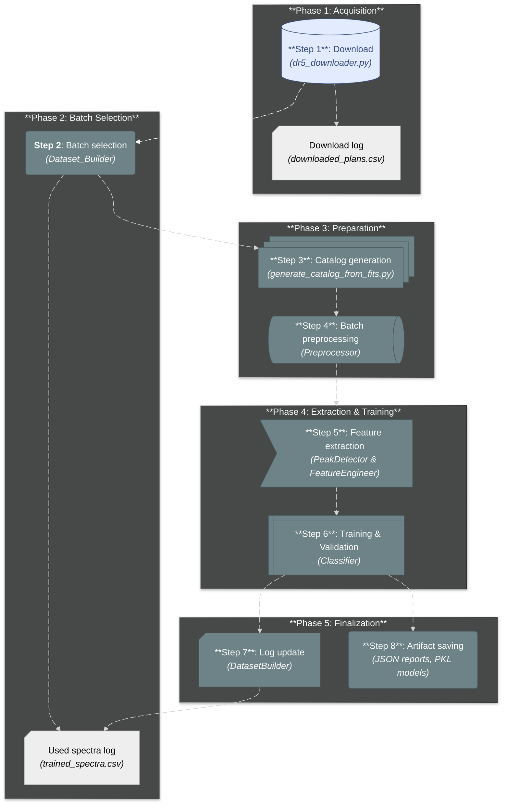

{/* Complete for v1.0.0 release once graph is completed */}

import { FontAwesomeIcon } from '@fortawesome/react-fontawesome'
import { faProjectDiagram } from '@fortawesome/free-solid-svg-icons'

# <FontAwesomeIcon icon={faProjectDiagram} /> Pipeline Overview

This page presents the complete workflow of the **AstroSpectro** project, from raw data acquisition to the generation of classification results. The pipeline is designed as a sequence of modular steps.

### Workflow Diagram

> The diagram below illustrates the main phases of the pipeline. Each phase is implemented by one or more specific modules in the source code.

### Phase Description

<h4>1. Acquisition (Optional)</h4>

The starting point. The ``SmartDownloader`` retrieves raw spectra from the **LAMOST** servers and stores them locally. It logs completed observation plans in ``downloaded_plans.csv`` to avoid redundant downloads.

<h4>2. Session Preparation</h4>

At each run, the ``DatasetBuilder`` selects a new batch of "fresh" spectra by consulting the ``trained_spectra.csv`` log. Then, a **local catalog** is generated from the **FITS** headers of this batch to ensure that the analysis is based on precise and up-to-date metadata.

<h4>3. Processing and Modeling</h4>

This is the core of the analysis. The ``ProcessingPipeline`` takes the batch of spectra and its local catalog, then executes the processing chain: preprocessing, line detection, and **extraction of a rich feature vector**. This feature dataset is then passed to the ``SpectralClassifier``, which handles **hyperparameter tuning** and **training** of the best model (``RandomForest`` or ``XGBoost``).

<h4>4. Finalization</h4>

Once the model has been trained, the pipeline concludes the session: the ``DatasetBuilder`` updates the ``trained_spectra.csv`` log with the spectra that have just been used. At the same time, the session **artifacts** (the ``.pkl`` model and a detailed *JSON* report) are saved in the ``data/models/`` and ``data/reports/`` folders for perfect traceability and reproducibility.

